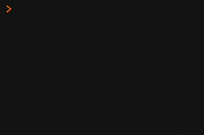

<!-- README.md is generated from README.Rmd. Please edit that file -->

# {choosethis}

<!-- badges: start -->

[](https://www.repostatus.org/#concept)
<!-- badges: end -->

A clickable ‘Choose Your Own Adventure’ in the R Console, powered by
[{cli}](https://cran.r-project.org/package=cli).



## How to play

You can install {choosethis} from GitHub.

``` r
if (!require(remotes)) install.packages("remotes")
install_github("matt-dray/choosethis")
library(choosethis)
```

To start a new game:

``` r
begin()
```

    You reach a fork in the road.
    * Go left
    * Go right

If your console supports links, then the words ‘left’ and ‘right’ in the
printout will be clickable. Choose one and you’ll be taken to the next
section.

## Theory

The [{cli} package](https://cran.r-project.org/package=cli) lets you
present [clickable ANSI
links](https://cli.r-lib.org/reference/links.html) to the user in the R
console.

That means we can create a ‘Choose Your Own Adventure’ where the user is
presented with options that they can click to advance the story.

{choosethis} uses
[cli::ansi_has_hyperlink_support()](https://cli.r-lib.org/reference/style_hyperlink.html)
to discover whether a user’s terminal can support these links. They will
work in RStudio, but not Terminal on macOS, for example. If links aren’t
supported, then the function name will be presented instead of a
clickable link.
